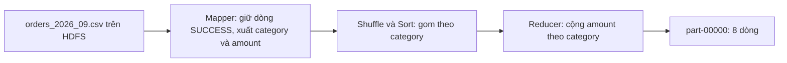

# hadoop-streaming-ecommerce-revenue

> Hadoop Streaming MapReduce lab: compute revenue by product category from e-commerce orders (Sept 2026) using a Python mapper/reducer on HDFS.

Bài thực hành Hadoop Streaming: phân tích đơn hàng thương mại điện tử tháng 09/2026 để tìm **nhóm sản phẩm có tổng doanh thu cao nhất**, chỉ tính các giao dịch `SUCCESS`.

**Kết quả chính:** nhóm **Electronics** dẫn đầu với **3.703.769.311** (76,94% tổng doanh thu SUCCESS). Top 3 gồm Electronics, Home, Fashion và chiếm 90,0% tổng doanh thu.

**Tác giả:** `<Họ tên>` — `<MSSV>` (điền hoặc xóa trước khi đăng công khai)

---

## 1. Bài toán

Ban vận hành sàn thương mại điện tử cần báo cáo nhanh nhóm sản phẩm tạo doanh thu lớn nhất để tối ưu tồn kho, khuyến mại và nguồn lực giao hàng.

- **Câu hỏi chính:** nhóm sản phẩm nào có tổng doanh thu cao nhất (chỉ tính `SUCCESS`)?
- **Câu hỏi phụ:** dữ liệu lưu ở đâu trong HDFS, job MapReduce tạo key–value thế nào, kết quả ghi ra đâu?

## 2. Dữ liệu đầu vào

File `data/orders_2026_09.csv`, kích thước 121.497 byte (≈ 118,6 KiB trên HDFS).

| Mục | Giá trị |
|---|---|
| Số giao dịch | 1.500 (1.501 dòng kể cả header) |
| Số cột | 11 |
| Null / trùng `transaction_id` | 0 / 0 |
| Khoảng ngày | 2026-09-01 đến 2026-09-30 |
| `status` | SUCCESS 1.240; FAILED 142; RETURNED 118 |
| `channel` | mobile 507; partner 497; web 496 |
| `category` | 8 nhóm: Electronics 353, Grocery 282, Fashion 281, Beauty 145, Home 142, Book 114, Sport 96, Toy 87 |
| `province` | 10 tỉnh/thành, nhiều nhất Ho Chi Minh (414) và Ha Noi (359) |

Các cột: `transaction_id, order_date, order_time, province, category, channel, quantity, unit_price, amount, status, shipping_days`. Ở mọi dòng, `amount = quantity × unit_price`. Dữ liệu không ghi đơn vị tiền tệ nên các con số dưới đây giữ nguyên theo dữ liệu gốc.

## 3. Cách hoạt động



**Mapper** (`src/mapper_revenue.py`): đọc từng dòng CSV; nếu `status == "SUCCESS"` thì xuất cặp
`key = category`, `value = amount` (ngăn cách bằng tab), ví dụ `Beauty<TAB>1001774`. Dòng FAILED và RETURNED bị bỏ. Với dữ liệu này mapper xuất **1.240 cặp**.

**Shuffle & sort:** Hadoop gom và sắp xếp các cặp theo key để các dòng cùng category đứng liền nhau. Bước này chưa có phép cộng nào.

**Reducer** (`src/reducer_revenue.py`): cộng dồn `amount` cho đến khi key đổi, rồi xuất `category<TAB>tổng`. Kết quả là **8 dòng**, mỗi category một dòng.

Ví dụ nhỏ: ba cặp `Book 100`, `Book 250`, `Toy 80` sau shuffle thành `Book → [100, 250]` và `Toy → [80]`; reducer cho `Book 350` và `Toy 80`.

**Vị trí trên HDFS** (thay `<mssv>` bằng tên thư mục người dùng của bạn):

| Mục | Đường dẫn |
|---|---|
| Dữ liệu vào | `/user/<mssv>/orders/orders_2026_09.csv` |
| Thư mục kết quả | `/user/<mssv>/output/revenue_by_category/` |
| File kết quả | `part-00000` (cùng file cờ `_SUCCESS`) |

Thư mục `-output` phải **chưa tồn tại** trước khi chạy job.

## 4. Môi trường đã dùng

| Thành phần | Giá trị |
|---|---|
| Nền tảng | Google Colab (CPU), Hadoop chạy một máy (pseudo-distributed) |
| Hadoop | 3.3.6 |
| Java | OpenJDK 8 |
| Thành phần chạy | NameNode, DataNode, ResourceManager, NodeManager (job chạy trên YARN) |
| Replication | 1 (một DataNode) |

Notebook cài đặt và chạy toàn bộ: `notebooks/hadoop_streaming_lab.ipynb`.

## 5. Cách chạy lại

**Kiểm tra cục bộ trước (không cần Hadoop):**

```bash
chmod +x src/mapper_revenue.py src/reducer_revenue.py
cat data/orders_2026_09.csv | src/mapper_revenue.py | sort -k1,1 | src/reducer_revenue.py
```

**Trên Hadoop:**

```bash
hadoop fs -mkdir -p /user/<mssv>/orders
hadoop fs -put -f data/orders_2026_09.csv /user/<mssv>/orders/
hadoop fs -ls -h /user/<mssv>/orders
hadoop fs -head /user/<mssv>/orders/orders_2026_09.csv

hadoop fs -rm -r -f /user/<mssv>/output/revenue_by_category
hadoop jar $HADOOP_HOME/share/hadoop/tools/lib/hadoop-streaming-3.3.6.jar \
  -D mapreduce.input.fileinputformat.split.minsize=134217728 \
  -files src/mapper_revenue.py,src/reducer_revenue.py \
  -mapper mapper_revenue.py \
  -reducer reducer_revenue.py \
  -input  /user/<mssv>/orders/orders_2026_09.csv \
  -output /user/<mssv>/output/revenue_by_category

hadoop fs -ls /user/<mssv>/output/revenue_by_category
hadoop fs -cat /user/<mssv>/output/revenue_by_category/part-00000
hadoop fs -cat /user/<mssv>/output/revenue_by_category/part-00000 | sort -k2,2nr | head -3
yarn application -list -appStates ALL
```

Tùy chọn `-D ...split.minsize=134217728` ép job chỉ có 1 split. Lý do ở mục 8.

## 6. Kết quả

**Bộ đếm của job thành công** (log thật, `streaming_log.txt`):

| Chỉ số | Giá trị |
|---|---|
| `number of splits` | 1 |
| `Launched map tasks` / `reduce tasks` | 1 / 1 |
| `Map input records` | 1.501 (1.500 đơn + 1 header) |
| `Map output records` | 1.240 (chỉ dòng SUCCESS) |
| `Reduce input groups` | 8 |
| `Reduce output records` | 8 |
| Trạng thái YARN | `FINISHED` / `SUCCEEDED` |
| Thời gian chạy | khoảng 27 giây (từ lúc submit đến completed) |

**Nội dung `results/part-00000`** (xếp theo key, chưa xếp theo doanh thu):

```
Beauty	111032003
Book	39306022
Electronics	3703769311
Fashion	218597763
Grocery	80983147
Home	410315065
Sport	166194354
Toy	83881779
```

Tổng doanh thu SUCCESS: **4.814.079.444**. Kết quả này trùng khớp với phép tính độc lập bằng pandas.

### Top 3 nhóm sản phẩm

| Hạng | Category | Doanh thu (SUCCESS) | Số đơn | Tỷ trọng | Đơn trung bình |
|---|---|---|---|---|---|
| 1 | Electronics | 3.703.769.311 | 296 | 76,94% | ≈ 12,5 triệu |
| 2 | Home | 410.315.065 | 110 | 8,52% | ≈ 3,7 triệu |
| 3 | Fashion | 218.597.763 | 233 | 4,54% | ≈ 0,94 triệu |

<details>
<summary>Bảng đầy đủ 8 nhóm</summary>

| Hạng | Category | Doanh thu | Số đơn | Tỷ trọng |
|---|---|---|---|---|
| 1 | Electronics | 3.703.769.311 | 296 | 76,94% |
| 2 | Home | 410.315.065 | 110 | 8,52% |
| 3 | Fashion | 218.597.763 | 233 | 4,54% |
| 4 | Sport | 166.194.354 | 78 | 3,45% |
| 5 | Beauty | 111.032.003 | 119 | 2,31% |
| 6 | Toy | 83.881.779 | 74 | 1,74% |
| 7 | Grocery | 80.983.147 | 229 | 1,68% |
| 8 | Book | 39.306.022 | 101 | 0,82% |

</details>

## 7. Nhận xét

1. Ba nhóm đứng đầu chiếm 90,0% doanh thu SUCCESS của tháng 09/2026.
2. Electronics tạo gần 77% doanh thu, gấp hơn 9 lần Home, nên là nhóm trọng yếu nhất.
3. Sức mạnh của Electronics đến từ **giá trị mỗi đơn rất cao**, không phải số đơn nhiều: Grocery có 229 đơn, gần bằng Fashion, nhưng đơn trung bình chỉ khoảng 0,35 triệu.
4. Fashion có nhiều đơn nhưng giá trị thấp, nên doanh thu chỉ đứng thứ ba.
5. Ban vận hành nên ưu tiên tồn kho và khuyến mại cho Electronics, đồng thời kiểm soát rủi ro giao hàng cho các đơn giá trị cao.
6. Doanh thu tập trung vào một nhóm là rủi ro nếu nhóm này biến động. Trong các đơn SUCCESS, 170 trong 174 đơn vượt ngưỡng outlier IQR (≈ 9,94 triệu) thuộc Electronics; đây là giá trị thật của hàng điện tử nên được giữ nguyên, không loại bỏ.

## 8. Bài học: lỗi header khi file bị chia nhiều split

Lần chạy đầu (không có tùy chọn `-D`) job vẫn báo `completed successfully` nhưng **kết quả sai**:

| Chỉ số | Lần 1 (sai) | Lần 2 (đúng) |
|---|---|---|
| `number of splits` | 2 | 1 |
| `Launched map tasks` | 2 | 1 |
| `Map output records` | **627** | **1.240** |
| Electronics (lần 1: mô phỏng lại việc chia 2 split, khớp đúng 627 bản ghi) | ≈ 2,06 tỷ | 3,70 tỷ |

**Nguyên nhân.** Hadoop Streaming dùng API MapReduce cũ, mặc định yêu cầu 2 map task, nên file chia làm đôi dù chỉ khoảng 121 KB, nhỏ hơn rất nhiều so với một block HDFS. `mapper_revenue.py` dùng `csv.DictReader`, vốn coi **dòng đầu tiên của đầu vào** là header. Mapper thứ hai nhận nửa sau của file, nên dòng dữ liệu đầu tiên của nó bị lấy làm tên cột; từ đó `row.get("status")` luôn là `None` và mapper này không xuất ra cặp nào.

**Cách xử lý đã dùng:** giữ nguyên script, thêm `-D mapreduce.input.fileinputformat.split.minsize=134217728` để file chỉ có 1 split, rồi kiểm tra `Map output records = 1240`.

**Cách bền vững hơn** (không dùng trong bài này vì đề cho sẵn script): bỏ `DictReader`, dùng `csv.reader` với chỉ số cột cố định và bỏ qua dòng có `transaction_id` ở cột đầu. Khi đó mapper đúng với mọi cách chia split.

Bài học: một job báo thành công chưa chắc cho kết quả đúng; cần đối chiếu bộ đếm (`Map output records`) với kết quả kiểm tra độc lập.

## 9. Hạn chế của xử lý batch

Kết quả chỉ có **sau khi cả job chạy xong**, nên không cập nhật theo thời gian thực: nếu có thêm đơn mới, phải chạy lại job trên dữ liệu mới. Ngoài ra Hadoop có chi phí khởi tạo cố định (khởi động JVM, xin container từ YARN); với dữ liệu chỉ 121 KB, thời gian khởi tạo lớn hơn nhiều so với thời gian tính toán, nên batch chỉ thật sự đáng khi dữ liệu rất lớn.

Các giới hạn khác của bài này: chạy trên một máy (replication 1, không có chịu lỗi thật), chỉ 1 reducer, và chưa so sánh hiệu năng với các cách xử lý khác.

## 10. Cấu trúc repository

```
hadoop-streaming-ecommerce-revenue/
├── data/
│   └── orders_2026_09.csv
├── src/
│   ├── mapper_revenue.py
│   └── reducer_revenue.py
├── results/
│   ├── part-00000
│   └── streaming_log.txt
├── notebooks/
│   └── hadoop_streaming_lab.ipynb
├── docs/
│   └── HadoopLab_HuongDan.md
├── screenshots/
└── README.md
```

**Ảnh chụp màn hình** (thêm vào `screenshots/`):

| File gợi ý | Nội dung |
|---|---|
| `01_hdfs_upload_ls_head.png` | `hadoop fs -ls` và `-head` sau khi upload |
| `02_streaming_job.png` | Lệnh `hadoop jar` và cuối log job |
| `03_output_ls_cat_top3.png` | `-ls` thư mục output, `-cat part-00000` và Top 3 |
| `04_yarn_application.png` | `yarn application -list` |

## 11. Lưu ý

- Dữ liệu và đề bài thuộc bài thực hành của môn học; hãy kiểm tra giảng viên có cho phép công khai không trước khi đặt repo ở chế độ public.
- Tên người dùng HDFS trong log thật có thể chứa mã số sinh viên; nếu đăng công khai, hãy thay bằng `<mssv>` như trong tài liệu này.
